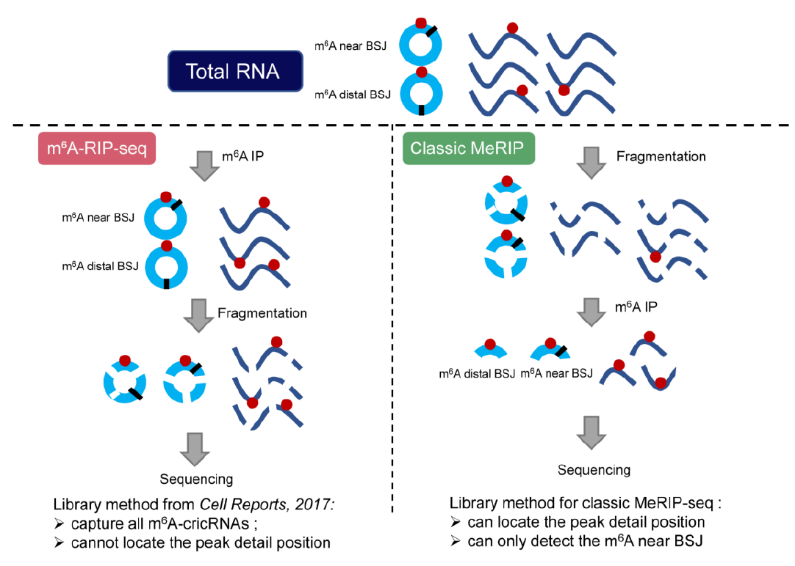

# Circm6A

Circm6A is a powerful tool for detection  m6A modification of circular RNA(circRNA).


## Table of Contents
* [Requirements](#Requirements)
* [Installation](#Installation)
* [Quick Start Guide](#QuickStart)
* [Usage](#Usage)
* [Example](#Example)
* [Output Headers](#OutputHeaders)
* [Tips](#Tips)
* [License](#License)

## Requirements

* JDK 8

## Installation

* This tool can be installed by instructions as follows:

```
git clone https://github.com/canceromics/circm6a.git
cd circm6a/huntcircRNA/src
javac -d ./ -classpath ./lib/* ./main/*.java ./genome/*.java ./mapping/*.java ./output/*.java
jar -cvmf META-INF/MANIFEST.MF ../../circm6a.jar *
```
The tool is generated as circm6a.jar in this directory.

## QuickStart

* Start from bam file of and input sample for example.

```
java -Xmx16g -jar circm6a.jar -input Input.bam -o ./example -g genome.fa
```
Running this instruction will result in getting a file named example_circRNAs.txt. `./example` means output_dir/file_prefix

More commonly used

```
java [-Xmx24g] -jar circm6a.jar -input <input.bam> -g <genome.fa> -o <path/out_prefix> [-ip ip.bam] [-r gencode.gtf] [options]
```

## Usage

* More details of this tool can be found with -h parameter

```
java -Xmx16g -jar circm6A.jar -h
Usage:
	java [-Xmx24g] -jar circm6a.jar -input <input.bam> -g <genome.fa> -o <path/out_prefix> [-ip ip.bam] [-r gencode.gtf] [options]
	
	<input.bam>	a bam/sam file of a sample mapping by bwa.
	<genome.fa>	a fasta file of the genome. The same as the file used by bwa is recommended.
	<path/out_prefix>	the path should exist and out_prefix is the first part of the output file name.
```

* Tips: -r enables exon boundary filter of circRNA detecting. -ip enables circle m6A peak detecting.

## Example

  ```
cd ../..
java -Xmx16g -jar circm6a.jar -ip test_data/HeLa_eluate_rep_1.chr22.bam -input test_data/HeLa_input_rep_1.chr22.bam -r test_data/gencode_chr22.gtf -g test_data/hg38_chr22.fa -o test_data/example_Hela
  ```

## OutputHeaders

* Here are definitions of headers in output file named `(output_dir/file_prefix)_circRNAs.txt`

| Field       | Description                           |
| ---------- | ------------------------------------ |
| Chr | Chromosome Name|
| Start | Start of circular RNA |
| End | End of circular RNA |
| Gene Name | Gene Symbol of gene covered circular RNA or 'None' for gene does not exist |
| Score | Total alignments near start or end of circular RNA |
| Strand | Strand of gene covered circular RNA or '.' for none gene |
| IP JunctionReads | number of BSJ reads supporting circular RNA in MeRIP sample if given|
| INPUT JunctionReads | number of BSJ reads supporting circular RNA in non-IP sample |
| LinearReads | number of reads near start or end of circular RNA but are not supporting in non-IP sample |
| CircRatio | ratio of BSJ reads over all near reads |
| IDs | IDs of BSJ reads detecting circular RNA if output in detail |

* Here are definitions of headers in output file named `(output_dir/file_prefix)_circ_peak.bed` and `(output_dir/file_prefix)_linear_peak.bed`

| Field       | Description                           |
| ---------- | ------------------------------------ |
| Chr | Chromosome Name|
| Start | Start of peak |
| End | End of peak |
| Name | Gene Symbol of gene covered peak or 'None' for gene does not exist |
| Score | combined p-value of peak |
| Strand | Strand of gene covered peak or '.' for none gene |
| thickStart | The same as start |
| thickEnd | The same as end |
| itemRgb | number of BSJ reads detecting circular RNA in MeRIP sample |
| blockCount | number of blocks included in peak region |
| blockSizes | size of each block |
| blockStarts | start of each block |
| Confidence | Show confidence of a peak in circular peaks |
| FDR | Show adjusted p-value of each peak |
| Proportion | Proportion of ratio of BSJ reads against to total reads between MeRIP sample and non-IP sample |


## Tips



Circm6A still has limitations when being applied to the MeRIP-seq data that was generated using the strategy of fragmentation before m6A-IP, which is the more frequently used library construction strategy since it could detect higher resolution m6A sites compared to the strategy of fragmentation after m6A-IP. For the strategy of fragmentation before m6A-IP, if the m6As are located in the circRNAs but distal to BSJs, the circRNA fragments pulled down by m6A-IP will not have BSJ signal thus the m6A enrichment signal will not be connected with the circRNAs. Therefore, the m6A-circRNAs with m6As distal to BSJs will not be detected by Circm6As and other circRNA detection tools. The analysis on our simulated data validated this assumption. To address this limitation, we developed a random forest model for the prediction of m6A modification status from the MeRIP-seq data. The random forest model will complement the Circm6A results.

## License
Licensed GPLv3 for open source use or contact zuoLab (zuozhx@sysucc.org.cn) for commercial use.
